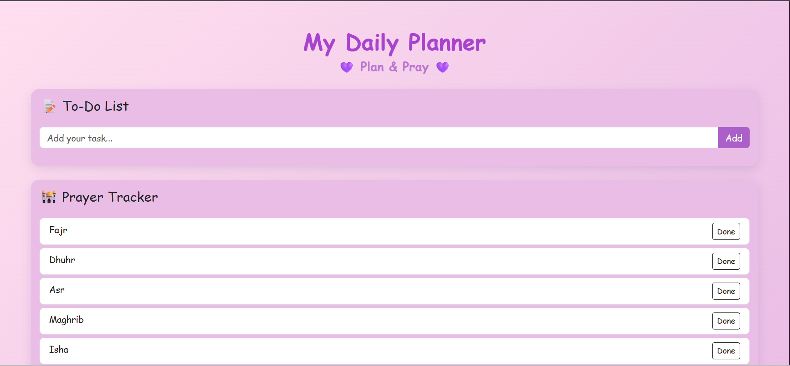
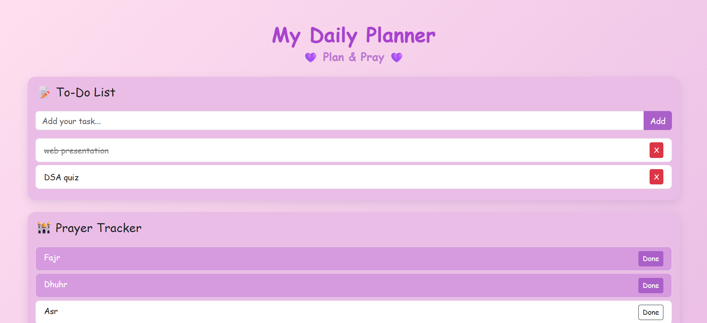

# Daily Planner - Plan & Pray

A simple and user-friendly web application that helps users manage their daily tasks while keeping track of their daily prayers. The application combines productivity and spiritual well-being by allowing users to organize tasks and monitor prayer completion in one place.

## Features

* Add daily tasks to a to-do list.
* Mark tasks as completed.
* Delete tasks from the list.
* Track five daily prayers:

  * Fajr
  * Dhuhr
  * Asr
  * Maghrib
  * Isha
* Simple and responsive user interface.
* Helps users stay organized and maintain prayer consistency.

## Technologies Used

* HTML5
* CSS3
* JavaScript

## Live Demo

https://ayeshabibi-tech.github.io/Daily-Planner/

## Screenshot

## Purpose of the Project

This project was developed as a Web Engineering course project. The goal is to provide a simple daily planning application that combines task management with prayer tracking to encourage productivity and spiritual discipline.

## Future Improvements

* Edit existing tasks.
* Store data using Local Storage.
* Add dark mode.
* Add task priorities.
* Add reminders and notifications.
* Improve mobile responsiveness.
* Add user authentication.

## Author

Ayesha Bibi

BS Software Engineering

University of Haripur

## License

This project is developed for educational purposes.
